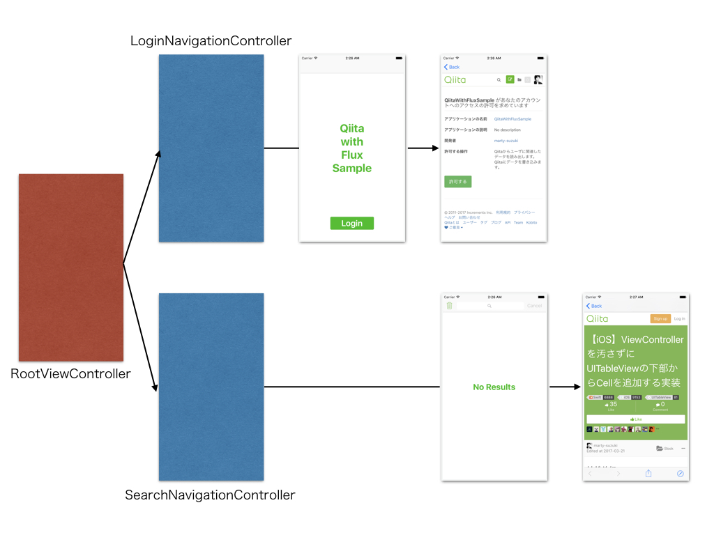
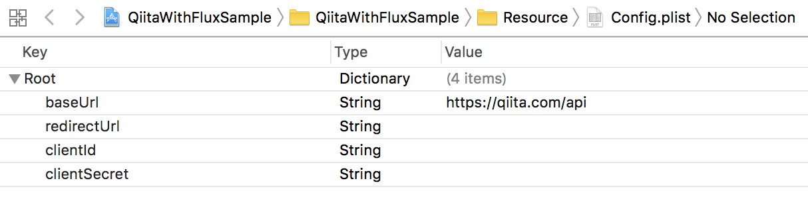
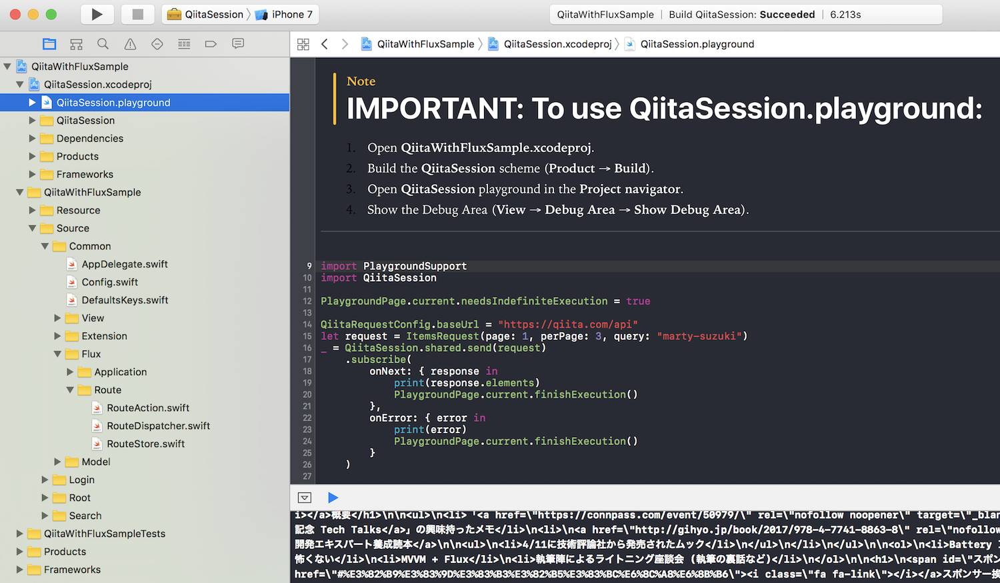

# QiitaWithFluxSample

This is a sample project that uses **Flux** and **MVVM** features.

## Features

- ViewController Routing with Flux
- AccessToken management with Flux
- Items searching action with MVVM

## Flux Classes

- Application
  - ApplicationAction
  - ApplicationDispatcher
  - ApplicationStore
- Route
  - RouteAction
  - RouteDispatcher
  - RouteStore

## Structures

- RootViewController (switching currentViewController based on RouteStore's value)
  - RootViewModel
  - LoginNavigationController
    - LoginTopViewController
      - LoginTopViewModel
    - LoginViewController (loading Qiita web site and authorizing user via ApplicationAction)
      - LoginViewModel
      - LoginViewDataSource
  - SearchNavigationController
    - SearchTopViewController (searching items from Qiita)
      - SearchTopViewModel
      - SearchTopDataSource

## Requirements

- Swift 3.1
- Xcode 8.3.2
- iOS 10.0
- Carthage 0.22.0

Please register your application to Qiita.  
After that, fill **redirectUrl**, **clientId** and **clientSecret** in Config.swift!

## Libraries

- [Action](https://github.com/RxSwiftCommunity/Action) 3.1.1
- [RxSwift](https://github.com/ReactiveX/RxSwift) 3.5.0
- [APIKit](https://github.com/ishkawa/APIKit) 3.1.2
- [Himotoki](https://github.com/ikesyo/Himotoki) 3.0.1
- [Nuke](https://github.com/kean/Nuke) 5.1.1
- [SwiftyUserDefaults](https://github.com/radex/SwiftyUserDefaults) 3.0.1

## Playground

API client (QiitaSession) is independent from QiitaWithFluxSample project because trying API call in the Playground before run in main project.

## Special Thanks

This sample uses [Qiita API](https://qiita.com/api/v2/docs).

## Author

marty-suzuki, s1180183@gmail.com

## License

ReverseExtension is available under the MIT license. See the LICENSE file for more info.
